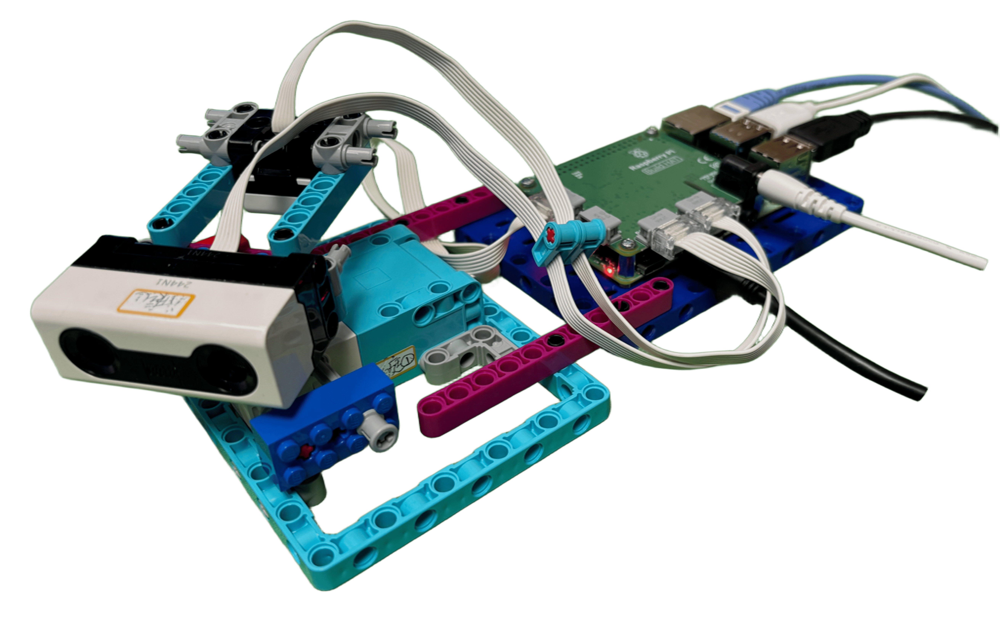
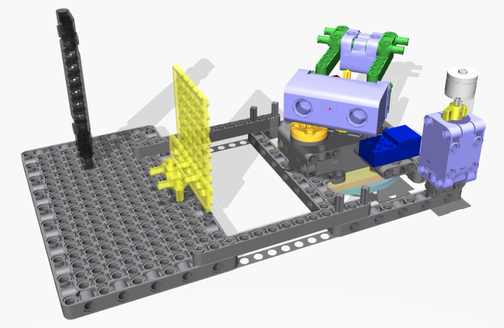
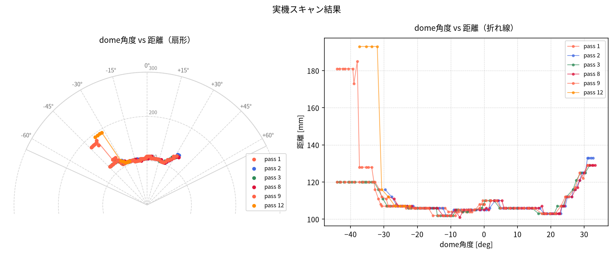
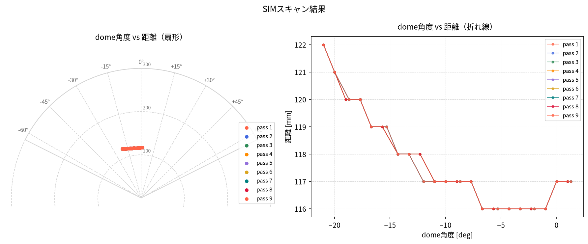

# sonar_radar

LEGO SPIKE Prime + Raspberry Pi Build HAT を使った2Dレーダースキャナー。
[libspikehat](https://github.com/kuboaki/libspikehat) 経由でデバイスを制御します。

本プロジェクトは**デジタルツイン**として開発しています。実機・シミュレーションの
どちらでも同じアプリケーションコード（`raspi/sonar_radar.py`)が動作し、
MuJoCoシミュレーション（`sim/sonar_radar_sim.py` + `libspikehat_sim`）で
動作確認・調整を行ったコードを、そのまま実機（Raspberry Pi + libspikehat）で動かせます。



[English README](README.md)

## ハードウェア構成

| ポート | デバイス | 役割 |
|--------|---------|------|
| A (0) | SPIKE Prime Lアンギュラーモーター | ドーム旋回（ギア減速1:3、回転方向反転） |
| B (1) | SPIKE Prime フォースセンサー | スキャン終了スイッチ |
| C (2) | SPIKE Prime カラーセンサー | 旋回端マーカー検出（赤=左端, 青=右端） |
| D (3) | SPIKE Prime 距離センサー | 障害物計測 |

### 旋回端マーカー

- **赤マーカー** — 左端（負方向）
- **青マーカー** — 右端（正方向）

ドームは赤・青マーカーを検出するたびに旋回方向を反転しながら往復スキャンを行い、
フォースセンサー（終了スイッチ）が押されると停止します。

## スキャン仕様

| パラメータ | 値 |
|-----------|-----|
| サンプリング間隔 | 50 ms |
| 有効距離 | 50〜300 mm |
| 原点（0°） | 正面中央（起動時にキャリブレーション） |

## 実機での実行

- Raspberry Pi 4 + Build HAT
- **Raspberry Pi OS Bookworm (64bit)**
- [libspikehat](https://github.com/kuboaki/libspikehat) がビルド済みであること
- `python3-build-hat` インストール済み（`sudo apt install python3-build-hat`）

```bash
cd raspi
bash run.sh
```

`run.sh` は Build HAT ファームウェアをロードしてから `sonar_radar.py` を実行します。
`sonar_radar.py` を直接呼び出さず、必ず `run.sh` 経由で実行してください。

## シミュレーションでの実行（MuJoCo）

- macOS / Linux に `mujoco` と `libspikehat_sim`（`sim/libspikehat_sim/` 参照）がインストール済みであること
- macOSのビューア表示には `mjpython`（MuJoCoのpassive viewerに必要）を使用

```bash
cd sim
python3 sonar_radar_sim.py            # バッチ実行（結果のJSONを標準出力へ）
mjpython sonar_radar_sim.py --viewer  # 3Dビューア付き・実時間
```

`sonar_radar_sim.py` は、MuJoCoで動作するシミュレーション版 `spikehat` モジュールを
差し込んだ上で `raspi/sonar_radar.py` をそのまま実行します。`sonar_radar.py` への
変更はそのままシミュレーションに反映されます。シミュレーションは常に実時間
（`--speed 1.0` 固定）で実行されるため、実機の動作と直接比較できます。

ビューアのControlタブから、障害物の壁（`wall_x_ctrl`/`wall_y_ctrl`）を動かしたり、
終了スイッチ（`press_ctrl`）を押したりして対話的に動作確認ができます。
MuJoCoモデル自体の作成手順（Bricklink Studio設計からの変換）については
[mujoco_model/studio_to_mujoco.md](mujoco_model/studio_to_mujoco.md) を参照してください。



*シミュレーション実行中*

## 出力形式

標準出力に JSON 配列、ログは標準エラー出力に出力されます。

```json
[
  {"angle": 12, "dome_angle": -4.0, "distance_mm": 136},
  {"angle": 15, "dome_angle": -5.0, "distance_mm": 135},
  {"angle": 21, "dome_angle": -7.0, "distance_mm": null},
  ...
]
```

- `angle` — モーターエンコーダ角度（度、キャリブレーション後の0°基準）
- `dome_angle` — ドーム角度（度、`angle / -3`）
- `distance_mm` — 有効距離範囲外の場合は `null`

## 可視化

`raspi/sonar_plot.py` は出力JSONを読み込み、`dome_angle` と `distance_mm` の関係を
扇形プロットと折れ線プロットで表示します。往復スキャンのパスごとに色分けして重ね描きします。

```bash
python3 raspi/sonar_radar.py > scan.json
python3 raspi/sonar_plot.py scan.json -o scan_result.png --title "scan result"
```

| 実機（`docs/scan_real.json`） | シミュレーション（`docs/scan_sim.json`） |
|---|---|
|  |  |

実機の超音波距離センサーは指向性が広いため、壁を広い角度範囲（この例では約-45°〜+35°）
で検出しています。一方、SIM側の距離センサーは単一レイキャストのため、正面付近の
狭い角度範囲（この例では約-21°〜+1°）でしか壁を検出しません。この距離センサーのFOV
（指向性）の乖離は、現時点では未解消の既知の差異です（[mujoco_model/studio_to_mujoco.md](mujoco_model/studio_to_mujoco.md)参照）。

実機・SIMのスキャンデータ取得とプロット作成の手順は
[docs/visualization.md](docs/visualization.md) を参照してください。

## キャリブレーション

起動時にモーターを機械的0位置へ移動し、ギアの噛み合わせのズレを補正する
`SENSOR_HOME_OFFSET` 分だけ旋回して、ドームを正面（0°）に向けます。
事前の手動位置合わせは不要です。

## プロジェクト構成

```
sonar_radar/
├── raspi/                  実機用アプリケーション（Raspberry Pi上で実行）
│   ├── sonar_radar.py    メインスキャナースクリプト（シミュレーションと共用）
│   └── run.sh              起動スクリプト（ファームウェアロード＋スキャン実行）
├── sim/                     MuJoCoシミュレーション
│   ├── sonar_radar_sim.py  libspikehat_sim経由でsonar_radar.pyを実行するエントリポイント
│   └── libspikehat_sim/    MuJoCoベースのシミュレーションライブラリ（libspikehat互換API）
├── mujoco_model/            MuJoCoモデル（XML・メッシュ・Blenderエクスポートスクリプト）
│   └── studio_to_mujoco.md  Bricklink Studio → MuJoCoモデル作成手順
├── studio_model/            Bricklink Studioモデルファイル
└── docs/                    ドキュメント用画像
```

## ライセンス

MIT License
