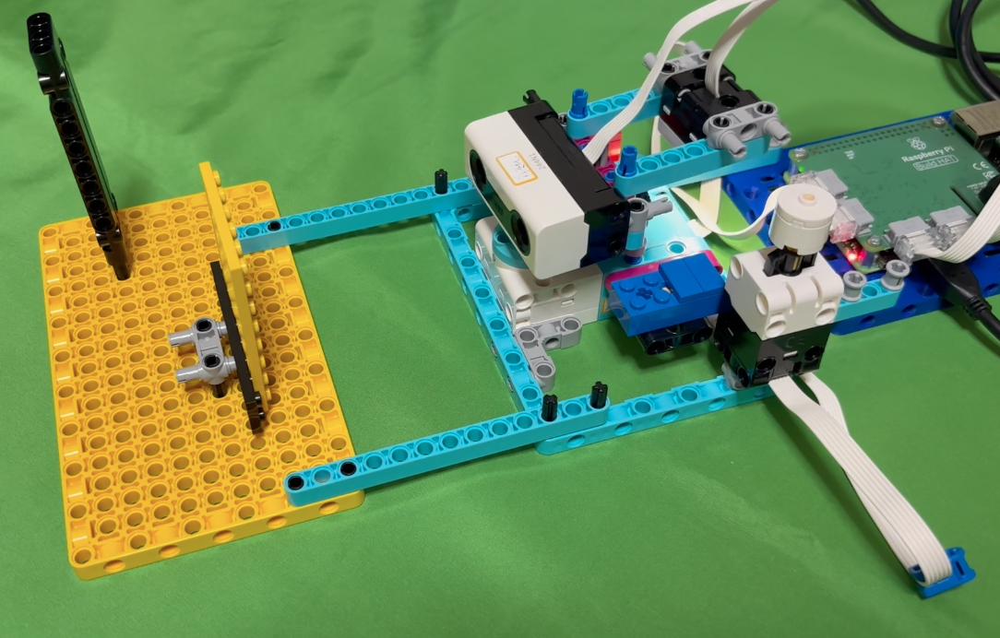
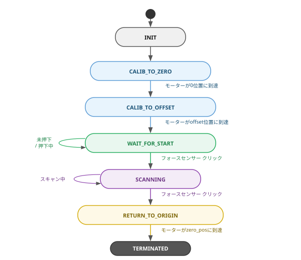

# sonar_radar

LEGO SPIKE Prime + Raspberry Pi Build HAT を使った2Dレーダースキャナー。
[libspikehat](https://github.com/kuboaki/libspikehat) 経由でデバイスを制御します。

本プロジェクトは**デジタルツイン**として開発しています。
アプリケーションコード（`raspi/sonar_radar.py`）を3つの環境で共用します。

| 環境 | ライブラリ | エントリポイント |
|------|-----------|----------------|
| 実機（Raspberry Pi） | `libspikehat` | `raspi/sonar_radar.py` の `main()` |
| スタンドアロンSIM（MuJoCo） | `libspikehat_sim` | `sim/sonar_radar_sim.py` |
| Hakoniwa SIM | `libspikehat_hako` | `sim/sonar_radar_hako.py` + `sim/sonar_radar_ctrl_hako.py` |



[English README](README.md)

## ハードウェア構成

| ポート | デバイス | 役割 |
|--------|---------|------|
| A (0) | SPIKE Prime Lアンギュラーモーター | ドーム旋回（ギア減速1:3、回転方向反転） |
| B (1) | SPIKE Prime フォースセンサー | スタート/ストップスイッチ |
| C (2) | SPIKE Prime カラーセンサー | 旋回端マーカー検出（赤=左端, 青=右端） |
| D (3) | SPIKE Prime 距離センサー | 障害物計測 |

### 旋回端マーカー

- **赤マーカー** — 左端（負方向）
- **青マーカー** — 右端（正方向）

ドームは赤・青マーカーを検出するたびに旋回方向を反転しながら往復スキャンを行います。

## スキャン仕様

| パラメータ | 値 |
|-----------|-----|
| サンプリング間隔 | 50 ms |
| 有効距離 | 50〜300 mm |
| 原点（0°） | 正面中央（起動時にキャリブレーション） |

## アーキテクチャ：開いたループ（ステートマシン）

`sonar_radar.py` は `SonarRadarSM` クラスとして実装されています。
`tick(hat)` を呼ぶたびに1ステップだけ処理してすぐリターンする「開いたループ」構造です。
外側ループ（system_driver）が `hat.sleep()` で時間を進める責任を持ちます。

```
# どの環境でも同じパターン
sm = SonarRadarSM(clock=...)
while not sm.is_terminated():
    sm.tick(hat)          # 1ステップ処理してリターン
    hat.sleep(INTERVAL)   # 環境によって内部実装が異なる
                          #   実機:      hat.sleep() → time.sleep()
                          #   スタンドアロンSIM: hat.sleep() → MuJoCoステップ
                          #   Hakoniwa:  hat.sleep() → hakopy.usleep()
```

### ステートマシン状態遷移



各状態は「1つの待つできごと」を持つフラットな1段のステートマシンです。
フラグ変数は状態として明示化されています。

## 実機での実行

- Raspberry Pi 4 + Build HAT
- **Raspberry Pi OS Bookworm (64bit)**
- [libspikehat](https://github.com/kuboaki/libspikehat) がビルド済みであること
- `python3-build-hat` インストール済み（`sudo apt install python3-build-hat`）

```bash
cd raspi
bash run.sh
```

`run.sh` は Build HAT ファームウェアをロードしてから `sonar_radar.py` を実行します。
`sonar_radar.py` を直接呼び出さず、必ず `run.sh` 経由で実行してください。

## スタンドアロンSIMでの実行（MuJoCo）

### セットアップ（初回のみ）

**前提**
- macOS + Homebrew の Python 3.12（`brew install python@3.12`）
- [uv](https://docs.astral.sh/uv/) インストール済み（`brew install uv`）

**1. venv作成とmujocoインストール**

```bash
cd sonar_radar   # リポジトリルート
uv venv --python /opt/homebrew/bin/python3.12
uv pip install mujoco==3.10.0
```

> **注意**: uv管理のスタンドアロンPython（`~/.local/share/uv/python/`）では
> `mjpython` が動作しません。必ずHomebrew製Pythonを使用してください。

> **注意**: mujoco の pip パッケージのバージョンと MuJoCo.app（`/Applications/MuJoCo.app`）の
> バージョンを必ず一致させてください。バージョンが異なると `libspikehat_sim` が
> クラッシュします（`mjModel` 構造体レイアウトの ABI 非互換）。

**2. libspikehat_simのビルド**

```bash
MUJOCO_ROOT=$(.venv/bin/python3 -c "import mujoco, os; print(os.path.dirname(mujoco.__file__))") \
  cmake -B sim/libspikehat_sim/build -S sim/libspikehat_sim
cmake --build sim/libspikehat_sim/build
```

### 実行

```bash
uv run python3 sim/sonar_radar_sim.py            # バッチ実行（結果のJSONを標準出力へ）
uv run mjpython sim/sonar_radar_sim.py --viewer  # 3Dビューア付き・実時間
```

ビューア起動時のキー操作：

| キー | 操作 |
|------|------|
| Space | スタート/ストップボタンを押す |
| 1 | 黄色壁（wall_a）を選択 |
| 2 | 黒壁（wall_b）を選択 |
| ←→ | 選択中の壁をX方向に移動 |
| ↑↓ | 選択中の壁をY方向に移動 |


#### 非インタラクティブ実行（ボタン自動注入）

```bash
# キャリブレーション後 3秒でスタート、スタートから 20秒後にストップ
python3 sim/sonar_radar_sim.py --auto-start 3 --auto-stop 20
```

## Hakoniwa SIMでの実行

Hakoniwa は複数のシミュレーターを統一された時刻で協調動作させるフレームワークです。
物理シミュレーション（plant）と制御ロジック（controller）を独立したアセットとして実行し、
PDU（Protocol Data Unit）を経由してセンサー値・制御指令を交換します。

### アーキテクチャ

```
Asset 1（物理: sonar_radar_hako.py）
  MuJoCo物理シミュレーション
  └─ センサー読み取り → PDU（CH0:Range, CH1:ColorRGBA, CH3:motor_angle, CH4:force_sensor）
  └─ PDU（CH2:turret_torque） → モーター制御
  └─ qpos → /tmp/sonar_radar_qpos.bin → viewer（表示のみ）

Asset 2（制御: sonar_radar_ctrl_hako.py）
  libspikehat_hako（HakoSpikeHat）
  └─ PDU読み取り → SonarRadarSM.tick() → PDU書き込み
  └─ hat.sleep() = hakopy.usleep()（シミュレーション時刻で待機）
```

Hakoniwa の時刻同期設計により、コントローラーの `hat.sleep()` が
`hakopy.usleep()` を呼ぶことでシミュレーション時刻ベースのタイミングが実現します。
コンダクターの実行速度に依存しない正確な時刻同期が可能です。

### セットアップ

**前提**
- [hakoniwa-mujoco-robots](https://github.com/toppers/hakoniwa-mujoco-robots) がセットアップ済み
- `hakopy` が Python 3.14（Homebrew）で利用可能（`run-hakopy.bash` 経由で実行）

sonar_radar の設定ファイルを hakoniwa-mujoco-robots へリンクします：

```bash
cd ~/Projects/hakoniwa-mujoco-robots/config
ln -s ~/Projects/sonar_radar/sim/sonar-radar-pdudef-compact.json .
ln -s ~/Projects/sonar_radar/sim/sonar-radar-pdutypes.json .
```

### 実行

**起動順序を必ず守ってください**（plant → controller → hako-cmd start）。

```bash
# ターミナル 1: plant（conductor も内包）
cd ~/Projects/hakoniwa-mujoco-robots
bash run-hakopy.bash ~/Projects/sonar_radar/sim/sonar_radar_hako.py --viewer

# ターミナル 2: controller
bash run-hakopy.bash ~/Projects/sonar_radar/sim/sonar_radar_ctrl_hako.py

# ターミナル 3: シミュレーション開始
hako-cmd start
```

viewer 起動時のキー操作：

| キー | 操作 |
|------|------|
| Space | スタート/ストップボタンを押す（plant へファイル経由で通知） |
| 1 | 黄色壁（wall_a）を選択 |
| 2 | 黒壁（wall_b）を選択 |
| ←→ | 選択中の壁をX方向に移動 |
| ↑↓ | 選択中の壁をY方向に移動 |

> **注意**: ビューアーはHakoniwaアーキテクチャの外側にある可視化専用プロセスです。
> MuJoCo物理状態（qpos）をファイル経由で受け取り表示するだけで、
> PDU・zenohとは無関係です。SpaceキーもファイルIPCで plant に通知します。
> 壁の移動（1/2/矢印キー）は `hako-cmd start` 後にのみ有効です。

#### 自動注入モード

```bash
bash run-hakopy.bash ~/Projects/sonar_radar/sim/sonar_radar_ctrl_hako.py \
  --auto-start 3 --auto-stop 20
```

| オプション | 意味 |
|------------|------|
| `--auto-start SEC` | シミュレーション開始から SEC 秒後にスタートボタンを自動注入 |
| `--auto-stop SEC` | スタートボタン注入から SEC 秒後にストップボタンを自動注入 |
| （省略時） | 物理ボタン操作（Space キー）を待つ |

> **注意**: Hakoniwa のコンダクターはデフォルトでリアルタイムペーシングを行いません。
> シミュレーション時刻は壁時計より速く進むため、ドームの旋回がスタンドアロンSIMより
> 速く見えます。これは仕様です（コンダクターAPIにペーシング設定がないため）。

## 出力形式

標準出力に JSON 配列、ログは標準エラー出力に出力されます。

```json
[
  {"angle": 12, "dome_angle": -4.0, "distance_mm": 136},
  {"angle": 15, "dome_angle": -5.0, "distance_mm": 135},
  {"angle": 21, "dome_angle": -7.0, "distance_mm": null},
  ...
]
```

- `angle` — モーターエンコーダ角度（度、キャリブレーション後の0°基準）
- `dome_angle` — ドーム角度（度、`angle / -3`）
- `distance_mm` — 有効距離範囲外の場合は `null`

## 可視化

`raspi/sonar_plot.py` は出力JSONを読み込み、`dome_angle` と `distance_mm` の関係を
扇形プロットと折れ線プロットで表示します。往復スキャンのパスごとに色分けして重ね描きします。

```bash
python3 raspi/sonar_radar.py > scan.json
python3 raspi/sonar_plot.py scan.json -o scan_result.png --title "scan result"
```

| 実機（`docs/scan_real.json`） | シミュレーション（`docs/scan_sim.json`） |
|---|---|
|  |  |

実機の超音波距離センサーは指向性が広いため、壁を広い角度範囲で検出します。
SIM側の距離センサーは単一レイキャストのため、正面付近の狭い角度範囲でしか壁を検出しません。
この距離センサーのFOV乖離は現時点では未解消の既知の差異です。

## キャリブレーション

起動時にモーターを機械的0位置へ移動し、ギアの噛み合わせのズレを補正する
`SENSOR_HOME_OFFSET` 分だけ旋回して、ドームを正面（0°）に向けます。
事前の手動位置合わせは不要です。

## プロジェクト構成

```
sonar_radar/
├── raspi/                         実機用アプリケーション
│   ├── sonar_radar.py             SonarRadarSM（ステートマシン）+ 実機用main()
│   ├── sonar_plot.py              スキャン結果の可視化
│   ├── run.sh                     起動スクリプト
│   └── libspikehat/               実機用ライブラリ（submodule）
├── sim/                           シミュレーション
│   ├── sonar_radar_sim.py         スタンドアロンSIMエントリポイント
│   ├── sonar_radar_hako.py        Hakoniwa plant（Asset 1）
│   ├── sonar_radar_ctrl_hako.py   Hakoniwa controller（Asset 2）
│   ├── sonar_radar_viewer.py      Hakoniwa用ビューアープロセス
│   ├── libspikehat_hako.py        Hakoniwa版 SpikeHat API（HakoSpikeHat）
│   ├── libspikehat_sim/           MuJoCo版ライブラリ（submodule）
│   └── *.json                     Hakoniwa PDU定義
├── mujoco_model/                  MuJoCoモデル（XML・メッシュ）
│   └── studio_to_mujoco.md        Bricklink Studio → MuJoCo変換手順
├── studio_model/                  Bricklink Studioモデルファイル
└── docs/                          ドキュメント用画像
```

## ライセンス

MIT License
